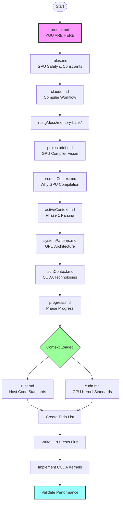

# prompt.md

## Prompt Ingestion Data Flow for rustg GPU Compiler



## Information Flow Summary

**Key Information Extracted at Each Stage:**

- **rules.md** → GPU memory safety, kernel constraints, CUDA testing requirements
- **claude.md** → GPU compiler TDD workflow, parsing phases, performance targets
- **Memory Bank Files** → rustg project context, Phase 1 tokenization/parsing focus
- **rust.md/cuda.md** → Hybrid Rust/CUDA standards, GPU kernel testing, performance benchmarks

## File Loading Order

Please read and understand the rustg GPU compiler project context by loading these files in order:

1. First read `rules.md` - Contains GPU safety rules, kernel constraints, and CUDA testing requirements
2. Then read `claude.md` - Contains GPU compiler workflow and project phases overview
3. Then read ALL files in the `rustg/docs/memory-bank/` directory for complete project context:
   - `rustg/docs/memory-bank/projectbrief.md` - GPU compiler vision and 10x speedup goals
   - `rustg/docs/memory-bank/productContext.md` - Why GPU compilation matters
   - `rustg/docs/memory-bank/activeContext.md` - Current Phase 1 parsing focus
   - `rustg/docs/memory-bank/systemPatterns.md` - GPU architecture patterns (SoA, warp cooperation)
   - `rustg/docs/memory-bank/techContext.md` - CUDA/GPU technology stack
   - `rustg/docs/memory-bank/progress.md` - Phase implementation status
   - `rustg/docs/memory-bank/architecture/` - GPU memory and parallel algorithms
   - `rustg/docs/memory-bank/phases/` - Detailed phase implementation plans

## Project Directory Structure

Quick reference for rustg project layout:

```
rustg/
├── CMakeLists.txt              # Main build configuration for CUDA
├── Makefile                     # Hybrid build orchestration
├── build.rs                     # Rust build script for CUDA compilation
├── Cargo.toml                   # Rust project configuration
│
├── src/                         # Source code directory
│   ├── lib.rs                   # Rust library entry point
│   ├── main.rs                  # Compiler driver
│   │
│   ├── core/                    # Core GPU infrastructure
│   │   ├── memory/              # GPU memory management
│   │   │   ├── allocator.rs     # Memory allocation
│   │   │   └── pool.cu          # CUDA memory pooling
│   │   ├── kernel/              # Kernel launching infrastructure
│   │   │   └── launcher.rs      # Safe kernel launch wrapper
│   │   └── utils/               # GPU utilities
│   │       └── cuda_utils.cu    # CUDA helper functions
│   │
│   ├── lexer/                   # Tokenization phase (Phase 1)
│   │   ├── mod.rs               # Rust module interface
│   │   ├── tokenizer.rs         # Safe FFI wrapper
│   │   └── kernels/             # CUDA tokenization kernels
│   │       ├── character_class.cu   # Character classification
│   │       ├── tokenizer.cu         # Main tokenization kernel
│   │       └── boundary.cu          # Token boundary resolution
│   │
│   ├── parser/                  # Parsing phase (Phase 1)
│   │   ├── mod.rs               # Rust module interface
│   │   ├── parser.rs            # Safe FFI wrapper
│   │   └── kernels/             # CUDA parsing kernels
│   │       ├── pratt.cu         # Pratt parser adaptation
│   │       └── ast.cu           # AST construction
│   │
│   ├── cpu/                     # CPU reference implementations
│   │   ├── tokenizer.rs         # CPU tokenizer (for validation)
│   │   └── parser.rs            # CPU parser (for validation)
│   │
│   └── ffi/                     # CUDA FFI bindings
│       └── cuda_sys.rs          # Low-level CUDA bindings
│
├── include/                     # C++ headers for CUDA
│   ├── gpu_types.h              # GPU data structures
│   ├── rustg.h                  # Main header
│   └── kernels.cuh              # Kernel declarations
│
├── tests/                       # Test directory
│   ├── unit/                    # Unit tests
│   ├── integration/             # Integration tests
│   ├── e2e/                     # End-to-end tests
│   ├── benchmarks/              # Performance benchmarks
│   └── fixtures/                # Test data files
│
├── docs/                        # Documentation
│   └── memory-bank/             # Project context (Cline methodology)
│       ├── projectbrief.md      # Project vision
│       ├── productContext.md    # Why GPU compilation
│       ├── activeContext.md     # Current work focus
│       ├── systemPatterns.md    # Architecture patterns
│       ├── techContext.md       # Technology stack
│       ├── progress.md          # Implementation progress
│       ├── architecture/        # Detailed architecture docs
│       │   ├── gpu-memory-architecture.md
│       │   ├── parallel-algorithms.md
│       │   └── performance-targets.md
│       └── phases/              # Phase implementation plans
│           ├── phase-overview.md
│           ├── current-phase-details.md
│           └── implementation-roadmap.md
│
└── tools/                       # Development tools
    ├── profiler/                # Performance profiling
    └── validator/               # Validation tools

Key Files for Phase 1 Implementation:
- src/lexer/kernels/tokenizer.cu - Main tokenization kernel
- src/lexer/kernels/boundary.cu - Token boundary resolution (critical)
- src/parser/kernels/ast.cu - AST construction on GPU
- tests/benchmarks/ - Performance validation (must meet 100x target)
- docs/memory-bank/activeContext.md - Current implementation status
```

Create a comprehensive todo list from the tasks, then implement using these mandatory GPU compiler practices:

**Development Standards:**

- Review and follow ALL standards defined in `rust.md` - for host-side Rust code and FFI interfaces
- For GPU kernels, strictly follow `cuda.md` - CUDA kernel standards, GPU memory patterns, performance requirements
- Mandatory GPU TDD workflow: Write kernel tests FIRST, then implementation (RED → GREEN → OPTIMIZE)
- All GPU performance targets must be met before proceeding (>100x parsing speedup target)
- **STRICT GPU TESTING REQUIREMENTS:**
  - Kernel correctness tests: REQUIRED for every CUDA kernel (validate against CPU reference)
  - Memory access tests: REQUIRED to verify coalesced access patterns
  - Performance benchmarks: REQUIRED to verify speedup targets (must exceed baseline)
  - Race condition tests: REQUIRED using cuda-memcheck for all parallel algorithms
  - Integration tests: REQUIRED for host-device data flow
  - NO kernel can be deployed without performance validation

**File Organization:**

- CUDA kernels in `rustg/src/lexer/kernels/` and `rustg/src/parser/kernels/`
- Host code in `rustg/src/core/` for GPU memory management
- Tests in `rustg/tests/` with separate GPU kernel tests
- Maximum 100 lines per CUDA kernel for maintainability
- Document all kernels with performance characteristics

**GPU Compiler Workflow:**

1. Read and understand all rustg context files
2. Create detailed todo list for Phase 1 parsing tasks
3. For each GPU kernel task:
   - Write CPU reference implementation first (baseline for correctness)
   - Write CUDA kernel tests (TDD red phase):
     - Correctness tests against CPU reference
     - Memory access pattern verification
     - Performance benchmark targets
   - Implement CUDA kernel (TDD green phase):
     - Start with basic functionality
     - Verify correctness first
   - Optimize kernel (TDD optimize phase):
     - Implement shared memory optimizations
     - Verify coalesced access patterns
     - Meet performance targets (>100x speedup)
   - Run ALL GPU quality checks:
     - `make test` - kernel correctness tests
     - `cuda-memcheck --tool memcheck` - memory error detection
     - `cuda-memcheck --tool racecheck` - race condition detection
     - `nvprof` or `nsight` - performance profiling
     - Verify memory bandwidth utilization >80%
   - Update memory-bank files with performance results

Begin by reading all the rustg context files, then create your todo list and start GPU kernel implementation following the standards in both `rust.md` and `cuda.md`.

**Key Features of rustg Development:**

1. **GPU-First Architecture** - All compilation happens on GPU with minimal CPU involvement
2. **Performance Critical** - Must achieve >100x speedup for parsing phase
3. **Memory Patterns** - Structure-of-Arrays (SoA) for coalesced GPU access
4. **Warp Cooperation** - 32 threads work together on token boundaries
5. **TDD for Kernels** - CPU reference → GPU implementation → Performance optimization
6. **Strict Testing** - Correctness, memory safety, race conditions, performance
7. **CUDA Standards** - Follow cuda.md for all kernel development
8. **Phase 1 Focus** - Current work on parallel lexing and parsing
9. **Performance Gates** - No progress without meeting speedup targets

**Current Phase 1 Priorities:**
- Token boundary resolution with warp cooperation
- Parallel lexer finite state machines
- AST construction in GPU memory
- Memory bandwidth optimization (>80% utilization)
- 100x parsing speedup validation
